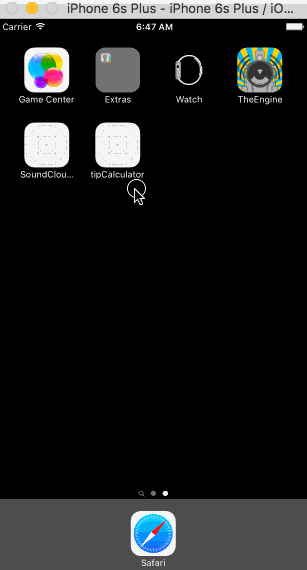

# CodePathIntroToiOS

This is my intro to iOS pre work test for CodePath. In addition to the steps I also implemented a frame and alpha animation as well as implemented some basic Autolayout constraints on the views.

The main view controller has a nested view with the total and tip labels inside which are together being animated via the x position. When you tap on the textfield it will trigger the animation and you can calculate your tip. You can also tap the bar button item "Settings" to change the default tip amount.

