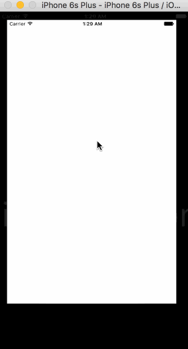

# CodePathIntroToiOS

# Pre-work - Tip Calcutron

Tip Calcutron is a tip calculator application for iOS.

Submitted by: Korin Wong-Horiuchi

Time spent: 5 hours spent in total

## User Stories

The following **required** functionality is complete:

* [ X ] User can enter a bill amount, choose a tip percentage, and see the tip and total values.
* [ X ] Settings page to change the default tip percentage.

The following **optional** features are implemented:
* [ X ] UI animations
* [ X ] Remembering the bill amount across app restarts (if <10mins)
* [ X ] Using locale-specific currency and currency thousands separators.
* [ X ] Making sure the keyboard is always visible and the bill amount is always the first responder. This way the user doesnt have to tap anywhere. They can just start using the app.

The following **additional** features are implemented:

- [ X ] Implemented AutoLayout so the app works on all devices.
- [ X ] Implemented a dark/light color mode.

## Video Walkthrough 

Heres a walkthrough of implemented user stories:

GIF created with [LiceCap](http://www.cockos.com/licecap/).

## Notes

Describe any challenges encountered while building the app.

I had to look up how to format the currency style and locale, but apart from that everything was pretty straight forward. There was no communication between view controllers so no need for a delegate protocol, as I was storing the users preferences/settings in NSUserDefaults which persists over view controller segues and app restarts.

## License

    Copyright [2016] [Korin Wong-Horiuchi]

    Licensed under the Apache License, Version 2.0 (the "License");
    you may not use this file except in compliance with the License.
    You may obtain a copy of the License at

        http://www.apache.org/licenses/LICENSE-2.0

    Unless required by applicable law or agreed to in writing, software
    distributed under the License is distributed on an "AS IS" BASIS,
    WITHOUT WARRANTIES OR CONDITIONS OF ANY KIND, either express or implied.
    See the License for the specific language governing permissions and
    limitations under the License.

